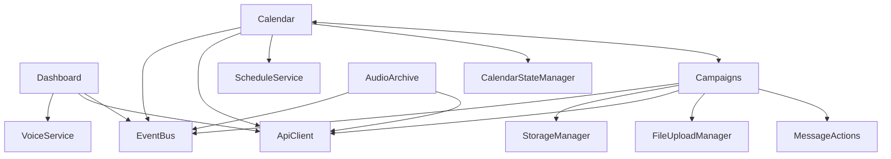

# 📚 Documentación del Sistema Casa Costanera

## Índice General

1. [Arquitectura y Módulos](#1-arquitectura-y-módulos)
2. [Base de Datos](#2-base-de-datos)
3. [Routers y Workflow](#3-routers-y-workflow)
4. [CSS y Diseño](#4-css-y-diseño)
5. [Playground](#5-playground)
6. [APIs y Endpoints](#6-apis-y-endpoints)
7. [Sistema de Audio](#7-sistema-de-audio)
8. [Sistema de Mensajes](#8-sistema-de-mensajes)
9. [Servicios y Workers](#9-servicios-y-workers)
10. [Configuración](#10-configuración)
11. [Sistema de Archivos](#11-sistema-de-archivos)
12. [Migraciones](#12-migraciones)
13. [Seguridad](#13-seguridad)
14. [Testing y Debugging](#14-testing-y-debugging)

---

## 1. Arquitectura y Módulos

### 1.1 Estructura General del Proyecto

```
/var/www/casa/
├── api/                    # APIs PHP legacy
├── config/                 # Configuraciones
├── database/              # Base de datos SQLite
│   ├── casa.db           # BD principal
│   └── migrations/       # Scripts de migración
├── public/               # Assets públicos
│   ├── styles-v5/       # Sistema de estilos moderno
│   └── Tests Files/     # Archivos de prueba
├── src/                 # Código fuente principal
│   ├── api/            # APIs PHP modernas
│   ├── core/           # Servicios centrales
│   └── modules/        # Módulos del sistema
├── storage/            # Almacenamiento de archivos
├── server.js          # Servidor Node.js principal
└── .env              # Variables de entorno
```

### 1.2 Módulos Principales

#### **Dashboard Module** (`/src/modules/dashboard/`)
- **Archivo Principal**: `index.js`
- **Template**: `template.html`
- **Función**: Panel de control principal
- **Características**:
  - Generación de audio TTS con ElevenLabs
  - Control de voces y parámetros (style, stability, similarity)
  - Lista de mensajes recientes
  - Sistema de categorías
  - Integración con VoiceService

**Dependencias**:
- `VoiceService` (core/voice-service.js)
- `apiClient` (core/api-client.js)
- `eventBus` (core/event-bus.js)

**Archivos críticos**:
- `index.js:46-104` - Método load() principal
- `index.js:268-312` - handleGenerate() para TTS
- `index.js:465-510` - saveToFavorites()

#### **Campaigns Module** (`/src/modules/campaigns/`)
- **Archivo Principal**: `index.js`
- **Función**: Gestión de mensajes guardados y campañas
- **Características**:
  - Biblioteca de mensajes reutilizables
  - Sistema de categorización
  - Upload de archivos de audio
  - Programación de mensajes

**Servicios**:
- `FileUploadManager` - Gestión de uploads
- `MessageActions` - Acciones sobre mensajes
- `formatters.js` - Utilidades de formato

**Dependencias**:
- Sincronización con módulo Calendar
- EventBus para comunicación entre módulos

#### **Calendar Module** (`/src/modules/calendar/`)
- **Archivo Principal**: `index.js`
- **Version**: 3.0 (Refactorizado)
- **Función**: Programación temporal de anuncios
- **Arquitectura**: Componentes modulares

**Componentes**:
- `CalendarView` - Vista del calendario
- `CalendarFilters` - Sistema de filtros
- `SchedulesList` - Lista de programaciones
- `CalendarLoader` - Cargador de datos
- `ScheduleActions` - Acciones de programación

**Servicios**:
- `ScheduleService` - Lógica de programación
- `CalendarStateManager` - Gestión de estado

**Templates**:
- `templates/calendar.html` - Template principal

#### **Audio Archive Module** (`/src/modules/audio-archive/`)
- **Archivo Principal**: `index.js`
- **Función**: Historial completo de archivos de audio
- **Características**:
  - Vista de todos los archivos (activos + eliminados)
  - Solo lectura
  - Búsqueda y filtrado avanzado
  - Paginación (50 items por página)

### 1.3 Servicios Core (`/src/core/`)

#### EventBus
- Sistema de eventos global
- Comunicación entre módulos
- Eventos principales:
  - `module:loaded`
  - `message:saved:library`
  - `calendar:loaded`
  - `library:loaded`

#### ApiClient
- Cliente HTTP centralizado
- Manejo de requests/responses
- Gestión de errores

#### VoiceService
- Gestión de voces TTS
- Configuración de parámetros
- Integración con ElevenLabs API

#### StorageManager
- Gestión de localStorage
- Persistencia de configuraciones

### 1.4 Interdependencias de Módulos



---

## 2. Base de Datos

### 2.1 Sistema de Base de Datos
- **Motor**: SQLite 3
- **Archivo**: `/database/casa.db`
- **Tamaño actual**: ~176 KB

### 2.2 Tablas Principales

#### **audio_metadata**
```sql
- id (PK, AUTOINCREMENT)
- filename (UNIQUE, NOT NULL) - Nombre único del archivo
- display_name - Nombre para mostrar
- category - Categoría (ofertas, eventos, etc.)
- voice_id - ID de voz ElevenLabs
- voice_name - Nombre de la voz
- created_at - Fecha de creación
- duration - Duración en segundos
- file_size - Tamaño del archivo
- is_saved (BOOLEAN) - Marcado como guardado
- is_active (BOOLEAN) - Soft delete
- saved_at - Fecha de guardado
- tags - Etiquetas JSON
- notes - Notas adicionales
- play_count - Contador de reproducciones
- last_played - Última reproducción
- source - Origen (tts/upload)
- metadata (JSON) - Metadata adicional
```

#### **calendar_events**
```sql
- id (PK)
- title - Título del evento
- file_path - Ruta del archivo
- file_id - ID del archivo
- category - Categoría
- start_datetime - Fecha/hora de inicio
- duration - Duración en segundos
- is_active - Estado activo
- priority (1-10) - Prioridad
- status - Estado (pending/completed/failed)
- locked_until - Bloqueado hasta
- created_by - Usuario creador
- notes - Notas
```

#### **audio_schedule**
```sql
- id (PK)
- filename - Archivo de audio
- title - Título
- schedule_time - Hora de programación
- schedule_days - Días (daily/weekdays/weekends/custom)
- start_date - Fecha inicio
- end_date - Fecha fin
- is_active - Estado
- priority - Prioridad
- category - Categoría
```

#### **categories**
```sql
- id (PK)
- name (UNIQUE) - Nombre de categoría
- color - Color hexadecimal
- icon - Icono
- description - Descripción
- is_active - Estado
```

#### **message_templates**
```sql
- id (PK)
- name - Nombre de plantilla
- content - Contenido
- category - Categoría
- variables (JSON) - Variables dinámicas
- usage_count - Contador de uso
```

#### **audio_favorites**
```sql
- id (PK)
- filename - Archivo
- user_session - Sesión de usuario
- is_active - Estado
- UNIQUE(filename, user_session)
```

#### **playback_history**
```sql
- id (PK)
- event_id (FK -> calendar_events)
- scheduled_time - Hora programada
- actual_time - Hora real de ejecución
- status - Estado
- error_message - Mensaje de error
- azuracast_response - Respuesta de AzuraCast
- execution_time_ms - Tiempo de ejecución
```

#### **statistics**
```sql
- id (PK)
- date - Fecha
- metric_name - Nombre de métrica
- metric_value - Valor
- metadata (JSON)
- UNIQUE(date, metric_name, client_id)
```

#### **system_config**
```sql
- key (PK) - Clave de configuración
- value - Valor
- type - Tipo (string/number/boolean/json)
- description - Descripción
```

### 2.3 Índices

```sql
-- Optimización de consultas frecuentes
idx_audio_metadata_category
idx_audio_metadata_is_saved
idx_audio_metadata_created_at
idx_events_datetime
idx_events_status
idx_history_event
idx_history_status
idx_favorites_active
idx_schedule_time
idx_schedule_active
idx_audio_schedule_category
```

### 2.4 Triggers

```sql
-- Actualización automática de timestamps
update_message_templates_timestamp
update_audio_metadata_timestamp
```

---

## 3. Routers y Workflow

### 3.1 Servidor Principal (server.js)

**Puerto**: 3003
**Funciones principales**:
- Servidor HTTP con Express
- Servicio de archivos estáticos
- Proxy para APIs PHP
- WebSocket para actualizaciones en tiempo real

### 3.2 Flujo de Navegación

```
1. Usuario accede a http://localhost:3003
2. Carga index.html con módulos base
3. Sistema de módulos carga dinámicamente:
   - Dashboard (default)
   - Campaigns
   - Calendar
   - Audio Archive
4. Cada módulo gestiona su propio routing interno
```

### 3.3 Workflow de Generación de Audio

```
1. Usuario ingresa texto en Dashboard
2. Selecciona voz y parámetros
3. Click en "Generar Audio"
4. Request a /api/generate.php
5. API llama a ElevenLabs
6. Audio se guarda en /api/temp/
7. Respuesta con URL del archivo
8. Reproducción en el navegador
9. Opción de guardar en biblioteca
```

### 3.4 Workflow de Programación

```
1. Usuario guarda mensaje en Campaigns
2. Sincronización con Calendar vía EventBus
3. Creación de evento en calendar_events
4. Scheduler PHP procesa eventos
5. Envío a AzuraCast para emisión
6. Log en playback_history
```

---

## 4. CSS y Diseño

### 4.1 Sistema de Estilos v5

**Ubicación**: `/public/styles-v5/`

```
styles-v5/
├── 0-settings/
│   ├── colors.css      # Variables de color
│   └── typography.css  # Tipografía
├── 1-base/
│   ├── reset.css      # Reset CSS
│   └── global.css     # Estilos globales
├── 2-components/
│   ├── buttons.css    # Botones
│   ├── forms.css      # Formularios
│   └── cards.css      # Tarjetas
├── 3-modules/
│   ├── dashboard.css  # Dashboard
│   ├── campaigns.css  # Campaigns
│   └── calendar.css   # Calendar
└── main.css          # Importador principal
```

### 4.2 Variables CSS Principales

```css
:root {
  /* Colores primarios */
  --primary: #3b82f6;
  --secondary: #64748b;
  --success: #10b981;
  --danger: #ef4444;
  --warning: #f59e0b;
  
  /* Backgrounds */
  --bg-primary: #0f172a;
  --bg-secondary: #1e293b;
  --bg-tertiary: #334155;
  
  /* Textos */
  --text-primary: #f1f5f9;
  --text-secondary: #94a3b8;
  
  /* Categorías */
  --cat-ofertas: #f59e0b;
  --cat-eventos: #8b5cf6;
  --cat-informacion: #3b82f6;
  --cat-servicios: #10b981;
  --cat-horarios: #06b6d4;
  --cat-emergencias: #ef4444;
}
```

### 4.3 Clases Principales

#### Botones
```css
.btn           /* Botón base */
.btn-primary   /* Botón principal */
.btn-secondary /* Botón secundario */
.btn-danger    /* Botón peligro */
.btn-icon      /* Botón solo icono */
```

#### Cards
```css
.card          /* Tarjeta base */
.card-header   /* Cabecera de tarjeta */
.card-body     /* Cuerpo de tarjeta */
.card-footer   /* Pie de tarjeta */
```

#### Badges
```css
.badge              /* Badge base */
.badge-ofertas      /* Badge ofertas */
.badge-eventos      /* Badge eventos */
.badge-informacion  /* Badge información */
```

#### Grid
```css
.grid-container    /* Contenedor grid */
.grid-2           /* 2 columnas */
.grid-3           /* 3 columnas */
.grid-4           /* 4 columnas */
```

---

## 5. Playground

### 5.1 Ubicación
`/public/playground-stable-*.tar.gz`

### 5.2 Archivos de Prueba

```
/public/Tests Files/
├── test-campaign-buttons.html
├── test-campaigns-compact.html
├── test-categories-debug.html
├── test-message-actions.html
└── test-message-actions-simple.html
```

### 5.3 Scripts de Debug

```javascript
// debug-calendar.js - Debug del calendario
// debug-categories-console.js - Debug de categorías
```

---

## 6. APIs y Endpoints

### 6.1 APIs PHP Principales

#### **/api/generate.php**
- **Función**: Generación de audio TTS
- **Método**: POST
- **Parámetros**:
  ```json
  {
    "action": "generate_audio",
    "text": "string",
    "voice": "voice_id",
    "category": "category",
    "voice_settings": {
      "style": 0.5,
      "stability": 0.75,
      "similarity_boost": 0.8,
      "use_speaker_boost": true
    }
  }
  ```
- **Respuesta**:
  ```json
  {
    "success": true,
    "filename": "audio_file.mp3",
    "audio_url": "/api/temp/audio_file.mp3"
  }
  ```

#### **/api/biblioteca.php**
- **Función**: Gestión de biblioteca de audio
- **Endpoints**:
  - GET: Lista archivos
  - POST: Guardar archivo
  - DELETE: Eliminar archivo
- **Parámetros GET**:
  - `action`: list_files
  - `category`: filtro por categoría
  - `search`: búsqueda de texto

#### **/api/calendar-api.php**
- **Función**: API del calendario
- **Endpoints**:
  - `get_events`: Obtener eventos
  - `create_event`: Crear evento
  - `update_event`: Actualizar evento
  - `delete_event`: Eliminar evento

#### **/api/saved-messages.php**
- **Función**: Mensajes guardados
- **Actions**:
  - `mark_as_saved`: Marcar como guardado
  - `soft_delete`: Eliminación lógica
  - `list_saved`: Listar guardados

#### **/api/recent-messages.php**
- **Función**: Mensajes recientes
- **Método**: GET
- **Respuesta**: Lista de últimos mensajes

#### **/api/audio-scheduler.php**
- **Función**: Programación de audio
- **Actions**:
  - `schedule_audio`: Programar audio
  - `get_schedules`: Obtener programaciones
  - `update_schedule`: Actualizar programación

### 6.2 Configuración API (config.php)

```php
// Configuraciones principales
- BASE_URL
- ELEVEN_LABS_API_KEY
- AZURACAST_API_KEY
- DATABASE_PATH
- TEMP_DIR
- MAX_FILE_SIZE
```

---

## 7. Sistema de Audio y Biblioteca

### 7.1 Flujo de Audio

```
1. Generación/Upload
   ↓
2. Almacenamiento temporal (/api/temp/)
   ↓
3. Procesamiento (metadata, duración)
   ↓
4. Guardado en biblioteca (/storage/audio/)
   ↓
5. Registro en BD (audio_metadata)
   ↓
6. Disponible para reproducción/programación
```

### 7.2 Formatos Soportados
- MP3 (principal)
- WAV
- OGG

### 7.3 Sistema de Favoritos
- Marcado por sesión de usuario
- Acceso rápido desde dashboard
- Sincronización con campaigns

### 7.4 Historial de Reproducción
- Tracking de cada reproducción
- Contador de reproducciones
- Última fecha de reproducción

---

## 8. Sistema de Mensajes y Templates

### 8.1 Tipos de Mensajes

#### Mensajes Generados (TTS)
- Creados con ElevenLabs
- Voz y parámetros configurables
- Guardado opcional

#### Mensajes Subidos
- Upload directo de archivos
- Procesamiento de metadata
- Categorización manual

#### Templates
- Plantillas reutilizables
- Variables dinámicas
- Contador de uso

### 8.2 Categorías de Mensajes

```javascript
const CATEGORIES = {
  'ofertas': { color: '#f59e0b', icon: '🏷️' },
  'eventos': { color: '#8b5cf6', icon: '🎉' },
  'informacion': { color: '#3b82f6', icon: 'ℹ️' },
  'servicios': { color: '#10b981', icon: '🛠️' },
  'horarios': { color: '#06b6d4', icon: '🕐' },
  'emergencias': { color: '#ef4444', icon: '🚨' },
  'sin_categoria': { color: '#6b7280', icon: '📁' }
};
```

---

## 9. Servicios y Workers

### 9.1 Server.js (Node.js)

**Puerto**: 3003
**Funciones**:
- Servidor HTTP principal
- Proxy para APIs PHP
- Servicio de archivos estáticos
- WebSocket (si está habilitado)

### 9.2 Scheduler PHP

**Archivo**: `/src/api/scheduler.php`
**Función**: Procesamiento de eventos programados
**Ejecución**: Cron job cada minuto

```bash
* * * * * php /var/www/casa/src/api/scheduler.php
```

### 9.3 Sistema de Logs

**Ubicación**: `/src/api/logs/`
**Archivos**:
- `scheduler.log` - Log del scheduler
- `api.log` - Log de APIs
- `error.log` - Errores del sistema

---

## 10. Configuración y Variables de Entorno

### 10.1 Archivo .env

```env
# API Keys
ELEVEN_LABS_API_KEY=your_key_here
AZURACAST_API_KEY=your_key_here

# Database
DB_PATH=/var/www/casa/database/casa.db

# Server
PORT=3003
NODE_ENV=production

# Paths
STORAGE_PATH=/var/www/casa/storage
TEMP_PATH=/var/www/casa/src/api/temp

# Limits
MAX_UPLOAD_SIZE=50M
MAX_TTS_LENGTH=5000
```

### 10.2 System Config (BD)

Configuraciones almacenadas en tabla `system_config`:
- Límites de quota
- Configuraciones de API
- Parámetros del sistema

---

## 11. Sistema de Archivos y Storage

### 11.1 Estructura de Storage

```
/storage/
├── audio/          # Archivos de audio permanentes
│   ├── tts/       # Generados por TTS
│   └── uploads/   # Subidos por usuarios
├── temp/          # Archivos temporales
├── exports/       # Exportaciones
└── backups/       # Respaldos
```

### 11.2 Gestión de Archivos Temporales

- Ubicación: `/src/api/temp/`
- Limpieza automática después de 24 horas
- Nombres únicos con timestamp

---

## 12. Migraciones y Versionado de BD

### 12.1 Sistema de Migraciones

**Ubicación**: `/database/migrations/`

### 12.2 Nomenclatura

```
YYYYMMDD_HHMMSS_description.sql
Ejemplo: 20240904_120000_add_category_column.sql
```

### 12.3 Ejecución

```bash
# Ejecutar migración
sqlite3 database/casa.db < database/migrations/migration_file.sql
```

---

## 13. Seguridad y Permisos

### 13.1 Permisos de Archivos

```bash
# Directorios escribibles
chmod 755 /var/www/casa/storage
chmod 755 /var/www/casa/src/api/temp
chmod 755 /var/www/casa/database

# Base de datos
chmod 666 /var/www/casa/database/casa.db
```

### 13.2 Validaciones

- Sanitización de inputs
- Validación de tipos de archivo
- Límites de tamaño
- Rate limiting en APIs

### 13.3 Autenticación

- Sistema basado en sesiones
- Tokens para API (si está habilitado)
- CORS configurado para dominios permitidos

---

## 14. Testing y Debugging

### 14.1 Archivos de Test

```
/public/Tests Files/
├── test-campaign-buttons.html    # Test de botones
├── test-campaigns-compact.html   # Test vista compacta
├── test-categories-debug.html    # Debug categorías
└── test-message-actions.html     # Test acciones
```

### 14.2 Comandos de Debug

```javascript
// Console del navegador

// Ver estado del EventBus
window.eventBus._events

// Ver módulo actual
window.currentModule

// Ver estado del dashboard
window.dashboardV2.state

// Ver mensajes en campaigns
window.campaignLibrary.messages
```

### 14.3 Logs del Sistema

```bash
# Ver logs del scheduler
tail -f /var/www/casa/src/api/logs/scheduler.log

# Ver logs de Node.js
pm2 logs

# Ver logs de PHP
tail -f /var/log/apache2/error.log
```

### 14.4 Debug de Base de Datos

```bash
# Acceder a la BD
sqlite3 /var/www/casa/database/casa.db

# Queries útiles
.tables
.schema audio_metadata
SELECT COUNT(*) FROM audio_metadata;
SELECT * FROM calendar_events WHERE is_active = 1;
```

---

## Notas Importantes

### Compatibilidad
- Node.js >= 14.x
- PHP >= 7.4
- SQLite >= 3.x
- Navegadores modernos (Chrome, Firefox, Safari, Edge)

### Respaldos
- Respaldar `/database/casa.db` regularmente
- Respaldar `/storage/audio/` para archivos permanentes
- Exportar configuraciones desde system_config

### Mantenimiento
- Limpiar `/src/api/temp/` periódicamente
- Revisar logs semanalmente
- Actualizar dependencias mensualmente
- Optimizar BD trimestralmente

---

*Documentación generada el 04/09/2025*
*Sistema Casa Costanera v4.0*