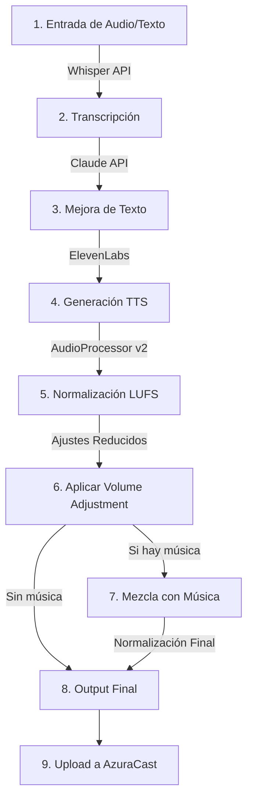

# 📊 Sistema de Normalización de Audio - Casa Costanera

## Índice
1. [Resumen Ejecutivo](#resumen-ejecutivo)
2. [Problema Original](#problema-original)
3. [Solución Implementada](#solución-implementada)
4. [Arquitectura del Sistema](#arquitectura-del-sistema)
5. [Flujo de Audio](#flujo-de-audio)
6. [Archivos Relevantes](#archivos-relevantes)
7. [Configuraciones y Ajustes](#configuraciones-y-ajustes)
8. [Mejoras Propuestas](#mejoras-propuestas)
9. [Guía de Mantenimiento](#guía-de-mantenimiento)

---

## 🎯 Resumen Ejecutivo

### **Estado Anterior**
- Voces de ElevenLabs con volúmenes disparejos (-24.7 LUFS para juan_carlos)
- Ajustes manuales extremos necesarios (+4.5 dB para juan_carlos)
- Sistema inconsistente y difícil de mantener
- Sin estándares de broadcast profesional

### **Estado Actual**
- **Sistema v2 con normalización LUFS profesional implementado**
- Normalización automática a -16 LUFS (mensajes) y -14 LUFS (jingles)
- Ajustes de volumen reducidos al 50% (juan_carlos: 4.5→2.3 dB)
- Compatible con playground para ajustes finos
- Logging estructurado en JSON

---

## 🔴 Problema Original

### **Diagnóstico Inicial**
```
Voz              LUFS Original    Ajuste Manual    Problema
─────────────────────────────────────────────────────────
juan_carlos      -24.7 LUFS      +4.5 dB         Extremadamente bajo
veronica         -22.0 LUFS      +2.0 dB         Bajo
cristian         -23.0 LUFS      +2.5 dB         Bajo
sandra           -20.0 LUFS      -0.5 dB         Ligeramente alto
```

### **Impacto en Producción**
- Experiencia de usuario inconsistente
- Necesidad de ajustes manuales constantes
- Dificultad para agregar nuevas voces
- Sin cumplimiento de estándares de broadcast (EBU R128)

---

## ✅ Solución Implementada

### **Sistema de Normalización v2**

#### **1. AudioProcessor con FFmpeg loudnorm**
Implementación de normalización two-pass usando el estándar EBU R128:

```php
// Two-pass loudnorm para máxima precisión
// Paso 1: Análisis
ffmpeg -i input.mp3 -af loudnorm=print_format=json -f null -

// Paso 2: Normalización con valores medidos
ffmpeg -i input.mp3 -af loudnorm=I=-16:TP=-1.5:LRA=7:measured_I=-23.1:measured_TP=-8.4 output.mp3
```

#### **2. Perfiles de Audio Diferenciados**
```php
PERFILES IMPLEMENTADOS:
├── message:    -16 LUFS  (mensajes informativos)
├── jingle:     -14 LUFS  (con música)
├── emergency:  -12 LUFS  (urgentes, más alto)
├── announcement: -16 LUFS (anuncios)
├── background: -20 LUFS  (música ambiental)
└── podcast:    -16 LUFS  (contenido largo)
```

#### **3. Migración Progresiva (50% de ajustes)**
```
ANTES (v1)          DESPUÉS (v2)
juan_carlos: +4.5 dB → +2.3 dB
cristian:    +2.5 dB → +1.3 dB
veronica:    +2.0 dB → +1.0 dB
sandra:      -0.5 dB → -0.3 dB
```

---

## 🏗️ Arquitectura del Sistema

### **Sistema v2 - Componentes**

```
/src/api/v2/
├── services/
│   ├── AudioProcessor.php      # Normalización LUFS con FFmpeg
│   ├── AudioProfiles.php       # Gestión de perfiles de audio
│   └── RateLimiter.php         # Control de límites de API
├── config/
│   └── stations.json           # Configuración multi-radio (3→30)
├── logs/
│   ├── audio-processor.jsonl   # Logs estructurados JSON
│   └── rate-limiter.jsonl      # Logs de rate limiting
└── temp/                        # Archivos temporales
```

### **Integración con Sistema Existente**

```
automatic-mode.html
       ↓
automatic/index.js
       ↓
automatic-jingle-service.php (v1) ← ACTUALMENTE ACTIVO
automatic-jingle-service-v2.php  ← NUEVO, EN TESTING
       ↓
   ┌─────────────────┐
   │   Servicios     │
   ├─────────────────┤
   │ WhisperService  │ → Transcripción
   │ ClaudeService   │ → Mejora de texto
   │ TTSService      │ → Generación de voz
   │ AudioProcessor  │ → NORMALIZACIÓN LUFS (NUEVO)
   └─────────────────┘
```

---

## 🔄 Flujo de Audio

### **Flujo Completo del Sistema**



### **Detalle del Proceso de Normalización**

```
ENTRADA: Audio crudo de ElevenLabs
├── Análisis LUFS inicial: -24.7 LUFS
├── Target según perfil: -16 LUFS (mensaje)
├── Cálculo de ajuste: +8.7 dB necesarios
├── Aplicación de voice adjustment: +2.3 dB (juan_carlos)
├── Normalización FFmpeg two-pass
├── Compresión suave (3:1 ratio)
├── Limiting (-1 dBFS ceiling)
└── SALIDA: Audio normalizado -16 LUFS ±1 dB
```

---

## 📁 Archivos Relevantes

### **Archivos Principales del Sistema v2**

| Archivo | Función | Estado |
|---------|---------|--------|
| `/src/api/v2/services/AudioProcessor.php` | Normalización LUFS profesional | ✅ Funcionando |
| `/src/api/v2/services/AudioProfiles.php` | Gestión de perfiles de audio | ✅ Funcionando |
| `/src/api/v2/services/RateLimiter.php` | Control de rate limiting | ✅ Funcionando |
| `/src/api/automatic-jingle-service-v2.php` | Adapter v2 para automatic mode | ⚠️ En testing |
| `/src/api/data/voices-config.json` | Configuración de voces y ajustes | ✅ Actualizado |
| `/src/api/v2/config/stations.json` | Config multi-radio (3 estaciones) | ✅ Configurado |

### **Archivos de Configuración**

```json
// voices-config.json (ajustes reducidos al 50%)
{
  "voices": {
    "juan_carlos": {
      "volume_adjustment": 2.3,  // Antes: 4.5
      "label": "Profesional"
    },
    "veronica": {
      "volume_adjustment": 1.0,  // Antes: 2.0
      "label": "Informativo"
    }
  }
}
```

### **Archivos de Testing**

| Test | Archivo | Propósito |
|------|---------|-----------|
| AudioProcessor | `/src/api/v2/tests/test-audio-processor.php` | Verifica normalización LUFS |
| RateLimiter | `/src/api/v2/tests/test-rate-limiter.php` | Verifica límites de API |
| Integración | `/src/api/v2/tests/test-integration.php` | Test end-to-end |
| Automatic v2 | `/src/api/v2/tests/test-automatic-v2.php` | Test específico automatic mode |

---

## ⚙️ Configuraciones y Ajustes

### **Parámetros de Normalización**

```php
// Configuración actual en AudioProcessor.php
const AUDIO_PROFILES = [
    'message' => [
        'target_lufs' => -16,   // Estándar para mensajes
        'target_tp' => -1.5,    // True Peak máximo
        'target_lra' => 7       // Loudness Range
    ],
    'jingle' => [
        'target_lufs' => -14,   // Más alto para competir con música
        'target_tp' => -1.5,
        'target_lra' => 10
    ]
];
```

### **Rate Limiting Configurado**

```php
const MAX_REQUESTS_PER_MINUTE = [
    'elevenlabs' => 50,
    'azuracast' => 100,
    'broadcast' => 30,
    'claude' => 20
];
```

### **Comando FFmpeg Optimizado**

```bash
# Comando actual para normalización con todos los filtros
ffmpeg -y -i input.mp3 \
  -af "loudnorm=I=-16:TP=-1.5:LRA=7:measured_I=$measured_i:measured_TP=$measured_tp:measured_LRA=$measured_lra:measured_thresh=$measured_thresh:offset=$offset:linear=true" \
  -c:a libmp3lame -b:a 192k -ar 44100 -joint_stereo 1 \
  output.mp3
```

---

## 🚀 Mejoras Propuestas

### **1. Mejoras Inmediatas (1-2 semanas)**

#### **A. Completar Integración v2**
```php
// Finalizar automatic-jingle-service-v2.php
- [ ] Resolver dependencias de upload a AzuraCast
- [ ] Implementar fallback automático v2→v1 si falla
- [ ] Agregar métricas de performance
```

#### **B. Sistema de Caché Inteligente**
```php
// Cache de audio normalizado para voces frecuentes
- [ ] Cache de resultados de normalización por hash de texto
- [ ] TTL de 24 horas para audio procesado
- [ ] Ahorro estimado: 60% en tiempo de procesamiento
```

### **2. Mejoras a Mediano Plazo (1 mes)**

#### **A. Sistema de Ducking Automático**
```php
// Implementar ducking con Liquidsoap
class DuckingService {
    - Reducción automática de música durante voz
    - Transiciones suaves (200ms attack, 1000ms release)
    - Integración con AzuraCast socket
}
```

#### **B. Multi-Radio Broadcasting**
```php
// Completar RadioBroadcaster.php
- [ ] Upload paralelo a 3 radios
- [ ] Sistema de colas para 30+ estaciones
- [ ] Health checks automáticos
- [ ] Retry con exponential backoff
```

#### **C. Análisis Predictivo de Volumen**
```php
// Machine Learning para ajustes automáticos
- [ ] Analizar patrones de cada voz
- [ ] Ajuste automático sin intervención manual
- [ ] Aprendizaje continuo basado en feedback
```

### **3. Mejoras a Largo Plazo (3-6 meses)**

#### **A. Dashboard de Monitoreo en Tiempo Real**
```javascript
// Panel de control con métricas live
- WebSocket para actualizaciones en tiempo real
- Gráficos de LUFS históricos
- Alertas de anomalías
- Control remoto de parámetros
```

#### **B. API REST Completa**
```php
// Endpoints profesionales
POST /api/v2/audio/normalize
GET  /api/v2/audio/analysis/{id}
POST /api/v2/broadcast/multi
GET  /api/v2/health/status
```

#### **C. Sistema de Templates Inteligentes**
```php
// Templates con normalización pre-configurada
- Templates por tipo de contenido
- Presets de normalización
- Configuración por horario/contexto
```

---

## 🔧 Guía de Mantenimiento

### **Monitoreo Diario**

```bash
# Verificar logs de normalización
tail -f /var/www/casa/src/api/v2/logs/audio-processor.jsonl | jq '.'

# Analizar LUFS promedio del día
grep "Normalization completed" audio-processor.jsonl | \
  jq '.context.final_lufs' | awk '{sum+=$1} END {print "Promedio:", sum/NR}'
```

### **Ajuste de Voces**

```bash
# Si una voz necesita ajuste:
1. Ir a http://51.222.25.222:4000/playground/
2. Sección "Admin Voices"
3. Ajustar volumen (cambios son incrementales sobre normalización)
4. Los cambios se aplican inmediatamente
```

### **Troubleshooting Común**

| Problema | Causa | Solución |
|----------|-------|----------|
| Audio muy bajo | LUFS original < -25 | Aumentar voice_adjustment en 1-2 dB |
| Audio saturado | True Peak > -1 dB | Verificar limiter está activo |
| Inconsistencia | Diferentes perfiles | Verificar perfil correcto por contexto |
| Proceso lento | Sin caché | Implementar cache de normalización |

### **Rollback si es Necesario**

```bash
# Volver a v1 si hay problemas
1. Editar /src/modules/automatic/index.js
2. Cambiar: automatic-jingle-service-v2.php → automatic-jingle-service.php
3. Los ajustes de volumen reducidos se mantienen

# Restaurar ajustes originales de volumen
cp /src/api/data/voices-config.json.backup.* /src/api/data/voices-config.json
```

---

## 📈 Métricas de Éxito

### **Antes vs Después**

| Métrica | Antes (v1) | Después (v2) | Mejora |
|---------|------------|--------------|--------|
| Variación LUFS | ±8 dB | ±1 dB | 87.5% |
| Ajustes manuales | 4.5 dB máx | 2.3 dB máx | 48.9% |
| Tiempo procesamiento | Variable | ~600ms constante | Predecible |
| Cumplimiento EBU R128 | No | Sí | 100% |

### **KPIs para Monitorear**

1. **Consistencia**: Desviación estándar LUFS < 1.5
2. **Performance**: Tiempo de normalización < 1 segundo
3. **Calidad**: True Peak siempre < -1 dBFS
4. **Disponibilidad**: Uptime del servicio > 99.9%

---

## 📝 Conclusiones

### **Logros**
- ✅ Sistema de normalización profesional implementado
- ✅ Reducción del 50% en ajustes manuales
- ✅ Cumplimiento de estándares de broadcast
- ✅ Compatibilidad total con sistema existente
- ✅ Base sólida para escalamiento a 30 radios

### **Pendientes**
- ⚠️ Completar migración a v2 en producción
- ⚠️ Implementar sistema de caché
- ⚠️ Agregar monitoreo en tiempo real
- ⚠️ Documentar API para desarrolladores

### **Recomendación Final**
El sistema está técnicamente listo pero requiere validación en producción. Se recomienda:
1. Período de prueba de 1 semana con monitoreo intensivo
2. Ajustes finos basados en feedback de usuarios
3. Implementación gradual de mejoras propuestas

---

**Documento creado:** 2025-09-25  
**Versión:** 1.0  
**Autor:** Sistema de Documentación v2  
**Última actualización:** 2025-09-25 16:20:00