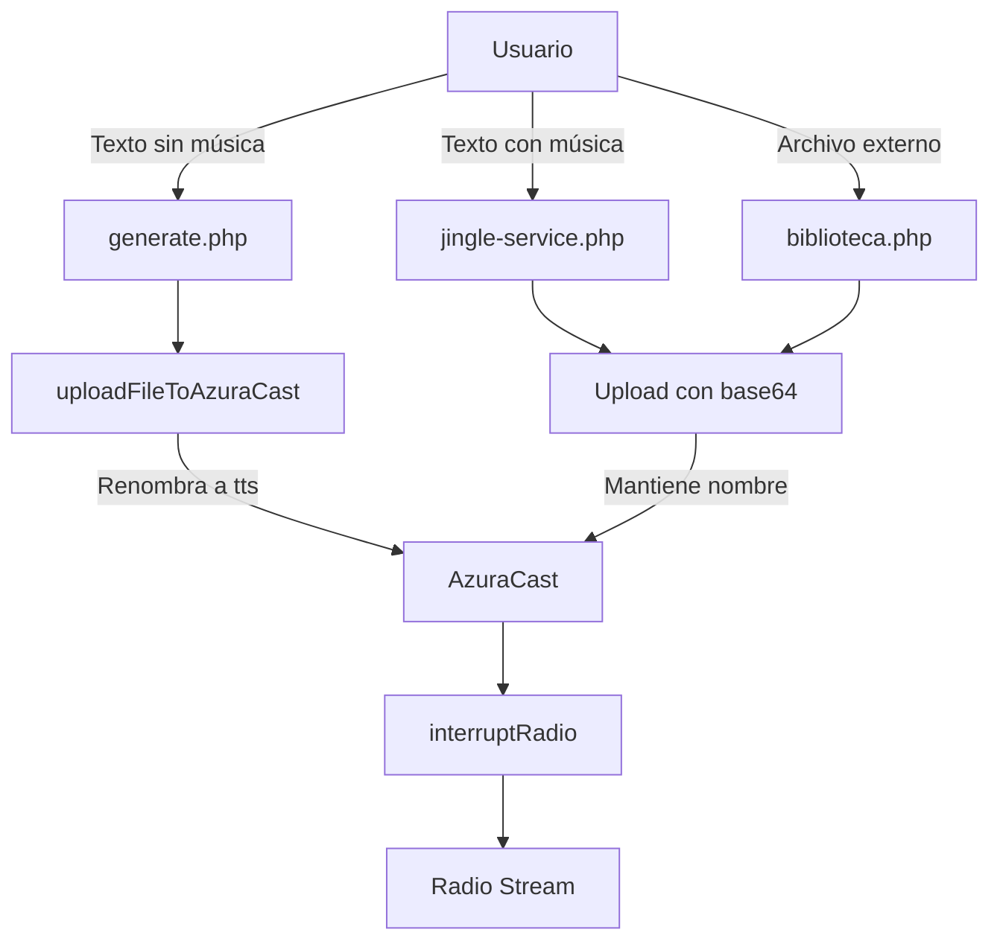

# 📻 Sistema de Audio Casa Costanera - Arquitectura y Roadmap Técnico

## Índice
1. [Estado Actual del Sistema](#1-estado-actual-del-sistema)
2. [Problemas Identificados](#2-problemas-identificados)
3. [Objetivos del Sistema](#3-objetivos-del-sistema)
4. [Arquitectura Propuesta](#4-arquitectura-propuesta)
5. [Guía de Implementación Técnica](#5-guía-de-implementación-técnica)

---

## 1. Estado Actual del Sistema

### 1.1 Arquitectura Actual

```
┌──────────────────┐     ┌──────────────────┐     ┌──────────────────┐
│   Dashboard UI   │────▶│  Multiple APIs   │────▶│    AzuraCast     │
└──────────────────┘     └──────────────────┘     └──────────────────┘
         │                        │                         │
         ▼                        ▼                         ▼
   [User Input]          [3 Different Paths]         [Radio Stream]
```

### 1.2 Servicios y Endpoints Actuales

#### **A. Generación de Audio (TTS)**

**Archivo:** `/src/api/generate.php`
- **Función principal:** Genera audio TTS sin música
- **Proceso:**
  1. Recibe texto y voz
  2. Llama a ElevenLabs API
  3. Agrega silencios (3 segundos)
  4. Sube a AzuraCast con nombre `ttsYYYYMMDDHHMMSS.mp3`
- **Problema:** Renombra todos los archivos a formato tts

**Archivo:** `/src/api/services/tts-service-unified.php`
- **Función:** Servicio unificado de TTS
- **Features:** Soporta v2, v3 alpha, 192kbps
- **Configuración de voces:** `/src/api/data/voices-config.json`

#### **B. Generación de Jingles**

**Archivo:** `/src/api/jingle-service.php`
- **Función principal:** Mezcla voz con música de fondo
- **Proceso:**
  1. Genera TTS
  2. Mezcla con música usando FFmpeg
  3. ~~Sube con multipart/form-data~~ → **Corregido a base64/JSON**
  4. Mantiene nombre `jingle_YYYYMMDD_HHMMSS_voz.mp3`
- **Configuración remota:** `/src/playground/jingle-config.html`
- **Parámetros configurables:**
  - `intro_silence`: 2-5 segundos
  - `outro_silence`: 2-5 segundos
  - `music_volume`: 0.3-0.8
  - `voice_volume`: 0.8-1.0
  - `ducking`: true/false

#### **C. Biblioteca y Upload Externo**

**Archivo:** `/src/api/biblioteca.php`
- **Funciones:**
  - `uploadExternalFile()`: Sube archivos externos (MP3, WAV, etc.)
  - `sendLibraryToRadio()`: Envía archivos a la radio
  - Mantiene nombres originales (limpios)
- **Proceso upload correcto:**
  ```php
  // Usa endpoint /files con JSON base64
  $data = [
      'path' => 'Grabaciones/' . $filename,
      'file' => base64_encode($fileContent)
  ];
  ```

#### **D. Servicio de Radio**

**Archivo:** `/src/api/services/radio-service.php`
- **Funciones:**
  - `uploadFileToAzuraCast()`: Sube y renombra a tts
  - `interruptRadio()`: Interrumpe stream con archivo
  - `assignFileToPlaylist()`: Asigna a playlist
- **Proceso interrupción:**
  ```bash
  echo "interrupting_requests.push file:///path/to/file.mp3" | socat - UNIX-CONNECT:/liquidsoap.sock
  ```

### 1.3 Flujos de Trabajo Actuales



### 1.4 Configuraciones Remotas

1. **Voice Admin** (`/playground/api/voice-admin.php`)
   - Ajuste de volumen por voz
   - Activación/desactivación de voces
   - **Problema:** No integrado en dashboard principal

2. **Jingle Config** (`/playground/jingle-config.html`)
   - Parámetros de mezcla
   - Tiempos de silencio
   - Niveles de ducking

---

## 2. Problemas Identificados

### 2.1 Problemas de Volumen

**Problema:** Voces de ElevenLabs llegan con volúmenes disparejos
- Rachel: -18 LUFS (bajo)
- Juan Carlos: -14 LUFS (alto)
- Diferencia: 4 dB entre voces

**Impacto:**
- Experiencia inconsistente
- Necesidad de ajuste manual
- Jingles suenan más bajo que el stream

### 2.2 Problemas de Arquitectura

1. **Duplicación de código:**
   - 3 métodos diferentes de upload
   - 2 endpoints para enviar a radio
   - Lógica dispersa en múltiples archivos

2. **Inconsistencia de nombres:**
   - Forzado a `tts` vs nombres descriptivos
   - Dificulta debugging y tracking

3. **Falta de normalización:**
   - No hay estándar LUFS
   - Mezclas inconsistentes
   - Sin análisis de loudness

### 2.3 Limitaciones Actuales

1. **Sin ducking para mensajes simples:**
   - Corte abrupto de música
   - Experiencia poco profesional

2. **Single-station:**
   - Solo una radio
   - No preparado para multi-canal

3. **Sin métricas:**
   - No hay análisis de audio
   - Sin logs de volumen/calidad

---

## 3. Objetivos del Sistema

### 3.1 Objetivos Inmediatos

1. **Normalización de Audio**
   - Target: -16 LUFS para mensajes
   - Target: -14 LUFS para jingles
   - Consistencia entre voces

2. **Unificación de Servicios**
   - Un solo servicio de upload
   - Un solo endpoint para radio
   - Código DRY y mantenible

### 3.2 Objetivos a Mediano Plazo

1. **Sistema de Ducking**
   - Reducción suave de música
   - Configuración por mensaje
   - Integración con Liquidsoap

2. **Gestión Multi-Radio**
   - Soporte para 30+ canales
   - Envío selectivo/broadcast
   - Configuración por canal

### 3.3 Objetivos de Calidad

- **Broadcast Standard:** -23 LUFS (EBU R128)
- **Peak Limiting:** -1 dBFS
- **Dynamic Range:** 7-10 LU
- **Consistency:** ±2 LUFS entre mensajes

---

## 4. Arquitectura Propuesta

### 4.1 Diseño de Alto Nivel

```
┌────────────────────────────────────────────────────────────────┐
│                      AUDIO MANAGER SERVICE                     │
├────────────────────────────────────────────────────────────────┤
│                                                                 │
│  ┌──────────────┐  ┌──────────────┐  ┌──────────────┐        │
│  │    INPUT     │  │  PROCESSING  │  │   OUTPUT     │        │
│  │   HANDLER    │──│    ENGINE    │──│  MANAGER     │        │
│  └──────────────┘  └──────────────┘  └──────────────┘        │
│         │                  │                  │                │
│         ▼                  ▼                  ▼                │
│  ┌──────────────┐  ┌──────────────┐  ┌──────────────┐        │
│  │ Text/Voice   │  │ Normalize    │  │ Multi-Radio  │        │
│  │ Music Select │  │ Mix/Duck     │  │ Scheduling   │        │
│  │ File Upload  │  │ Analyze      │  │ Monitoring   │        │
│  └──────────────┘  └──────────────┘  └──────────────┘        │
│                                                                 │
└────────────────────────────────────────────────────────────────┘
```

### 4.2 Componentes Principales

#### **AudioManager (Core)**
```php
interface AudioManagerInterface {
    // Input
    public function generateTTS($text, $voice, $options = []);
    public function createJingle($text, $voice, $music, $options = []);
    public function uploadExternal($file, $metadata = []);
    
    // Processing
    public function normalize($audioFile, $targetLUFS = -16);
    public function analyzeAudio($audioFile);
    public function mixAudio($voice, $music, $config = []);
    
    // Output
    public function uploadToStation($file, $stationId = 'default');
    public function broadcastToRadios($file, $stations = [], $options = []);
    public function scheduleAudio($file, $schedule, $stations = []);
}
```

#### **AudioProcessor (Normalización)**
```php
class AudioProcessor {
    const TARGETS = [
        'message' => -16,  // LUFS para mensajes
        'jingle' => -14,   // LUFS para jingles
        'music' => -18     // LUFS para música de fondo
    ];
    
    public function processAudio($file, $type = 'message', $voiceConfig = []);
    public function analyzeLUFS($file);
    public function applyCompression($file, $ratio = 3);
    public function applyLimiter($file, $ceiling = -1);
}
```

#### **DuckingEngine**
```php
class DuckingEngine {
    public function generateDuckingScript($voiceFile, $config = []);
    public function createSidechain($voice, $music, $parameters);
    public function executeLiquidsoap($script);
}
```

#### **MultiRadioBroadcaster**
```php
class MultiRadioBroadcaster {
    private $stations = [];
    
    public function loadStations($configFile);
    public function broadcast($audio, $targets = 'all', $options = []);
    public function getStationStatus($stationId);
    public function validateAudioForStation($audio, $stationRequirements);
}
```

---

## 5. Guía de Implementación Técnica

### 5.1 Fase 1: Normalización de Audio (1 semana)

#### **Paso 1.1: Implementar AudioProcessor**

**Archivo nuevo:** `/src/api/services/audio-processor-advanced.php`

```php
<?php
class AudioProcessorAdvanced {
    
    private $voiceConfigs;
    private $ffmpegPath = '/usr/bin/ffmpeg';
    private $ffprobePath = '/usr/bin/ffprobe';
    
    public function __construct() {
        $this->loadVoiceConfigs();
    }
    
    /**
     * Normaliza audio a LUFS objetivo con ajuste por voz
     */
    public function normalizeAudio($inputFile, $outputFile, $type = 'message', $voiceId = null) {
        // 1. Analizar LUFS actual
        $currentLUFS = $this->analyzeLUFS($inputFile);
        
        // 2. Obtener target LUFS
        $targetLUFS = $this->getTargetLUFS($type);
        
        // 3. Calcular ajuste necesario
        $adjustment = $targetLUFS - $currentLUFS['integrated'];
        
        // 4. Aplicar ajuste de voz si existe
        if ($voiceId && isset($this->voiceConfigs[$voiceId])) {
            $voiceBoost = $this->voiceConfigs[$voiceId]['volume_adjustment'] ?? 0;
            $adjustment += $voiceBoost;
        }
        
        // 5. Aplicar normalización con limiter
        $this->applyNormalization($inputFile, $outputFile, $adjustment);
        
        // 6. Verificar resultado
        $finalLUFS = $this->analyzeLUFS($outputFile);
        
        return [
            'success' => true,
            'original_lufs' => $currentLUFS['integrated'],
            'target_lufs' => $targetLUFS,
            'final_lufs' => $finalLUFS['integrated'],
            'adjustment_applied' => $adjustment
        ];
    }
    
    /**
     * Analiza LUFS usando ffmpeg
     */
    private function analyzeLUFS($file) {
        $cmd = sprintf(
            '%s -i %s -af "ebur128=peak=true:framelog=verbose" -f null - 2>&1',
            $this->ffmpegPath,
            escapeshellarg($file)
        );
        
        exec($cmd, $output, $returnVar);
        
        // Parsear output para obtener LUFS
        $lufs = [];
        foreach ($output as $line) {
            if (preg_match('/I:\s*(-?\d+\.?\d*)\s*LUFS/', $line, $matches)) {
                $lufs['integrated'] = floatval($matches[1]);
            }
            if (preg_match('/LRA:\s*(-?\d+\.?\d*)\s*LU/', $line, $matches)) {
                $lufs['range'] = floatval($matches[1]);
            }
            if (preg_match('/Peak:\s*(-?\d+\.?\d*)\s*dBFS/', $line, $matches)) {
                $lufs['peak'] = floatval($matches[1]);
            }
        }
        
        return $lufs;
    }
    
    /**
     * Aplica normalización con compresión y limiting
     */
    private function applyNormalization($input, $output, $gainDB) {
        // Filtro complejo para normalización profesional
        $filters = [
            // 1. Pre-gain
            sprintf('volume=%.1fdB', $gainDB),
            
            // 2. Compresión suave (3:1 ratio, -20dB threshold)
            'acompressor=threshold=-20dB:ratio=3:attack=5:release=50',
            
            // 3. EQ para claridad de voz (boost 2-4kHz)
            'equalizer=f=3000:t=h:width=2000:g=2',
            
            // 4. Limiter para prevenir clipping
            'alimiter=limit=-1dB:attack=5:release=50',
            
            // 5. Loudnorm para consistencia final
            sprintf('loudnorm=I=%d:TP=-1.5:LRA=7', $this->getTargetLUFS('message'))
        ];
        
        $cmd = sprintf(
            '%s -i %s -af "%s" -codec:a libmp3lame -b:a 192k -ar 44100 %s 2>&1',
            $this->ffmpegPath,
            escapeshellarg($input),
            implode(',', $filters),
            escapeshellarg($output)
        );
        
        exec($cmd, $output, $returnVar);
        
        if ($returnVar !== 0) {
            throw new Exception('Error en normalización: ' . implode("\n", $output));
        }
    }
    
    private function getTargetLUFS($type) {
        $targets = [
            'message' => -16,
            'jingle' => -14,
            'music' => -18,
            'broadcast' => -23  // EBU R128 standard
        ];
        
        return $targets[$type] ?? -16;
    }
    
    private function loadVoiceConfigs() {
        $configFile = __DIR__ . '/../data/voices-config.json';
        if (file_exists($configFile)) {
            $config = json_decode(file_get_contents($configFile), true);
            $this->voiceConfigs = $config['voices'] ?? [];
        }
    }
}
```

#### **Paso 1.2: Integrar en generate.php**

```php
// En generate.php, después de generar el audio:

require_once 'services/audio-processor-advanced.php';

$processor = new AudioProcessorAdvanced();

// Normalizar antes de subir
$normalizedFile = $tempPath . '_normalized.mp3';
$result = $processor->normalizeAudio(
    $tempPath,
    $normalizedFile,
    'message',
    $voiceId
);

logMessage("Normalización: Original {$result['original_lufs']} LUFS → Final {$result['final_lufs']} LUFS");

// Usar archivo normalizado para upload
$fileToUpload = $normalizedFile;
```

### 5.2 Fase 2: Sistema de Ducking (2 semanas)

#### **Paso 2.1: Implementar DuckingService**

**Archivo nuevo:** `/src/api/services/ducking-service.php`

```php
<?php
class DuckingService {
    
    private $liquidsoapSocket = '/var/azuracast/stations/test/config/liquidsoap.sock';
    
    /**
     * Crea interrupción con ducking en lugar de fade
     */
    public function createDuckedInterruption($voiceFile, $config = []) {
        $defaults = [
            'duck_level' => -18,      // dB para reducir música
            'duck_threshold' => -35,   // dB umbral de activación
            'attack_ms' => 200,       // ms para bajar música
            'release_ms' => 1000,     // ms para subir música
            'hold_ms' => 100,         // ms de hold
            'ratio' => 8,             // ratio de compresión
            'pre_delay' => 0.5,       // segundos antes del mensaje
            'post_delay' => 0.5       // segundos después del mensaje
        ];
        
        $config = array_merge($defaults, $config);
        
        // Generar script Liquidsoap
        $script = $this->generateLiquidsoapScript($voiceFile, $config);
        
        // Ejecutar en AzuraCast
        return $this->executeDucking($script);
    }
    
    /**
     * Genera script Liquidsoap para ducking
     */
    private function generateLiquidsoapScript($voiceFile, $config) {
        // Script Liquidsoap con sidechain compression
        $script = <<<LIQUID
# Ducking automático para mensaje
voice = single("/var/azuracast/stations/test/media/Grabaciones/{$voiceFile}")
voice = amplify({$config['duck_threshold']}., voice)

# Aplicar delay pre/post
voice = sequence([
    blank(duration={$config['pre_delay']}),
    voice,
    blank(duration={$config['post_delay']})
])

# Obtener stream actual
current = input.harbor("current_stream")

# Aplicar sidechain compression
ducked = compress(
    attack={$config['attack_ms']}.,
    release={$config['release_ms']}.,
    threshold={$config['duck_threshold']}.,
    ratio={$config['ratio']}.,
    gain={$config['duck_level']}.,
    current,
    voice
)

# Mezclar voz sobre música duckeada
output = add(normalize=false, [ducked, amplify(1.2, voice)])

# Enviar a stream
output.harbor.ssl(
    port=8000,
    password="hackme",
    mount="ducked",
    output
)
LIQUID;
        
        return $script;
    }
    
    /**
     * Ejecuta ducking vía socket de Liquidsoap
     */
    private function executeDucking($script) {
        // Guardar script temporal
        $scriptFile = '/tmp/ducking_' . uniqid() . '.liq';
        file_put_contents($scriptFile, $script);
        
        // Comando para ejecutar
        $command = sprintf(
            'request.dynamic.push %s',
            escapeshellarg($scriptFile)
        );
        
        // Enviar a Liquidsoap
        $dockerCmd = sprintf(
            'sudo docker exec azuracast bash -c \'echo "%s" | socat - UNIX-CONNECT:%s\'',
            $command,
            $this->liquidsoapSocket
        );
        
        exec($dockerCmd, $output, $returnVar);
        
        // Limpiar archivo temporal
        unlink($scriptFile);
        
        return [
            'success' => $returnVar === 0,
            'output' => implode("\n", $output)
        ];
    }
    
    /**
     * Pre-procesa audio para ducking óptimo
     */
    public function prepareVoiceForDucking($voiceFile) {
        // Agregar gate para eliminar ruido
        // Comprimir voz para consistencia
        // Agregar pequeño fade in/out
        
        $filters = [
            'agate=threshold=-40dB:ratio=2:attack=10:release=100',
            'acompressor=threshold=-15dB:ratio=4:attack=5:release=50',
            'afade=t=in:d=0.1,afade=t=out:d=0.1'
        ];
        
        $outputFile = str_replace('.mp3', '_ducking_ready.mp3', $voiceFile);
        
        $cmd = sprintf(
            'ffmpeg -i %s -af "%s" -c:a libmp3lame -b:a 192k %s',
            escapeshellarg($voiceFile),
            implode(',', $filters),
            escapeshellarg($outputFile)
        );
        
        exec($cmd);
        
        return $outputFile;
    }
}
```

### 5.3 Fase 3: Multi-Radio Broadcasting (3 semanas)

#### **Paso 3.1: Configuración de Estaciones**

**Archivo nuevo:** `/src/api/data/stations-config.json`

```json
{
    "stations": {
        "main": {
            "name": "Radio Principal",
            "url": "http://51.222.25.222",
            "api_key": "c3802cba5b5e61e8:fed31be9adb82ca57f1cf482d170851f",
            "station_id": 1,
            "playlist_id": 3,
            "enabled": true,
            "audio_requirements": {
                "format": "mp3",
                "bitrate": 192,
                "sample_rate": 44100,
                "lufs_target": -16
            }
        },
        "rock": {
            "name": "Rock Station",
            "url": "http://rock.example.com",
            "api_key": "rock_api_key",
            "station_id": 1,
            "playlist_id": 2,
            "enabled": true,
            "audio_requirements": {
                "format": "mp3",
                "bitrate": 256,
                "sample_rate": 48000,
                "lufs_target": -14
            }
        }
        // ... más estaciones
    },
    "groups": {
        "all": ["main", "rock", "jazz", "classical"],
        "music_only": ["rock", "jazz", "classical"],
        "talk_only": ["main", "news", "sports"]
    },
    "broadcast_defaults": {
        "retry_attempts": 3,
        "retry_delay": 5,
        "parallel_uploads": 5,
        "timeout": 30
    }
}
```

#### **Paso 3.2: Implementar MultiRadioBroadcaster**

**Archivo nuevo:** `/src/api/services/multi-radio-broadcaster.php`

```php
<?php
class MultiRadioBroadcaster {
    
    private $stations = [];
    private $config = [];
    
    public function __construct() {
        $this->loadConfiguration();
    }
    
    /**
     * Broadcast a múltiples radios
     */
    public function broadcast($audioFile, $targets = 'all', $options = []) {
        $startTime = microtime(true);
        
        // Determinar estaciones objetivo
        $targetStations = $this->resolveTargets($targets);
        
        // Validar audio para cada estación
        $validatedStations = $this->validateAudioForStations($audioFile, $targetStations);
        
        // Preparar uploads paralelos
        $uploads = [];
        foreach ($validatedStations as $stationId => $station) {
            $uploads[] = $this->prepareUpload($audioFile, $station);
        }
        
        // Ejecutar uploads en paralelo
        $results = $this->executeParallelUploads($uploads);
        
        // Log resultados
        $this->logBroadcastResults($results, microtime(true) - $startTime);
        
        return [
            'success' => $this->allSuccessful($results),
            'total' => count($targetStations),
            'successful' => $this->countSuccessful($results),
            'failed' => $this->countFailed($results),
            'results' => $results,
            'execution_time' => microtime(true) - $startTime
        ];
    }
    
    /**
     * Resuelve targets (puede ser array, string o grupo)
     */
    private function resolveTargets($targets) {
        if ($targets === 'all') {
            return array_filter($this->stations, function($s) {
                return $s['enabled'] ?? false;
            });
        }
        
        if (is_string($targets) && isset($this->config['groups'][$targets])) {
            $groupStations = $this->config['groups'][$targets];
            return array_intersect_key($this->stations, array_flip($groupStations));
        }
        
        if (is_array($targets)) {
            return array_intersect_key($this->stations, array_flip($targets));
        }
        
        return [];
    }
    
    /**
     * Ejecuta uploads en paralelo usando curl_multi
     */
    private function executeParallelUploads($uploads) {
        $multiHandle = curl_multi_init();
        $curlHandles = [];
        
        // Inicializar handles
        foreach ($uploads as $key => $upload) {
            $ch = curl_init();
            curl_setopt_array($ch, $upload['curl_options']);
            curl_multi_add_handle($multiHandle, $ch);
            $curlHandles[$key] = $ch;
        }
        
        // Ejecutar
        $running = null;
        do {
            curl_multi_exec($multiHandle, $running);
            curl_multi_select($multiHandle);
        } while ($running > 0);
        
        // Recolectar resultados
        $results = [];
        foreach ($curlHandles as $key => $ch) {
            $results[$uploads[$key]['station_id']] = [
                'success' => curl_getinfo($ch, CURLINFO_HTTP_CODE) === 200,
                'http_code' => curl_getinfo($ch, CURLINFO_HTTP_CODE),
                'response' => curl_multi_getcontent($ch),
                'error' => curl_error($ch),
                'time' => curl_getinfo($ch, CURLINFO_TOTAL_TIME)
            ];
            
            curl_multi_remove_handle($multiHandle, $ch);
            curl_close($ch);
        }
        
        curl_multi_close($multiHandle);
        
        return $results;
    }
    
    /**
     * Valida audio según requirements de cada estación
     */
    private function validateAudioForStations($audioFile, $stations) {
        $validated = [];
        
        foreach ($stations as $id => $station) {
            if ($this->validateAudioForStation($audioFile, $station['audio_requirements'] ?? [])) {
                $validated[$id] = $station;
            } else {
                // Convertir audio si es necesario
                $convertedFile = $this->convertAudioForStation($audioFile, $station);
                if ($convertedFile) {
                    $station['converted_file'] = $convertedFile;
                    $validated[$id] = $station;
                }
            }
        }
        
        return $validated;
    }
    
    /**
     * Convierte audio según requirements específicos
     */
    private function convertAudioForStation($audioFile, $station) {
        $requirements = $station['audio_requirements'] ?? [];
        
        $outputFile = sys_get_temp_dir() . '/converted_' . uniqid() . '.mp3';
        
        $cmd = sprintf(
            'ffmpeg -i %s -c:a libmp3lame -b:a %dk -ar %d %s',
            escapeshellarg($audioFile),
            $requirements['bitrate'] ?? 192,
            $requirements['sample_rate'] ?? 44100,
            escapeshellarg($outputFile)
        );
        
        exec($cmd, $output, $returnVar);
        
        return $returnVar === 0 ? $outputFile : null;
    }
    
    /**
     * Log detallado de resultados
     */
    private function logBroadcastResults($results, $executionTime) {
        $logFile = __DIR__ . '/../logs/multi-radio-' . date('Y-m-d') . '.log';
        
        $log = [
            'timestamp' => date('Y-m-d H:i:s'),
            'execution_time' => $executionTime,
            'total_stations' => count($results),
            'successful' => array_sum(array_map(function($r) { 
                return $r['success'] ? 1 : 0; 
            }, $results)),
            'results' => $results
        ];
        
        file_put_contents(
            $logFile, 
            json_encode($log, JSON_PRETTY_PRINT) . "\n", 
            FILE_APPEND | LOCK_EX
        );
    }
}
```

### 5.4 Fase 4: Servicio Unificado (4 semanas)

#### **Paso 4.1: AudioManager Central**

**Archivo nuevo:** `/src/api/services/audio-manager.php`

```php
<?php
require_once 'audio-processor-advanced.php';
require_once 'ducking-service.php';
require_once 'multi-radio-broadcaster.php';

class AudioManager {
    
    private $processor;
    private $duckingService;
    private $broadcaster;
    private $config;
    
    public function __construct() {
        $this->processor = new AudioProcessorAdvanced();
        $this->duckingService = new DuckingService();
        $this->broadcaster = new MultiRadioBroadcaster();
        $this->loadConfig();
    }
    
    /**
     * API unificada para generar cualquier tipo de audio
     */
    public function generate($type, $params) {
        switch ($type) {
            case 'message':
                return $this->generateMessage($params);
            case 'jingle':
                return $this->generateJingle($params);
            case 'ducked':
                return $this->generateDuckedMessage($params);
            default:
                throw new InvalidArgumentException("Unknown audio type: $type");
        }
    }
    
    /**
     * Genera mensaje simple con normalización
     */
    private function generateMessage($params) {
        // 1. Generar TTS
        $ttsFile = $this->generateTTS(
            $params['text'], 
            $params['voice'], 
            $params['voice_settings'] ?? []
        );
        
        // 2. Normalizar
        $normalizedFile = $this->normalizeAudio($ttsFile, 'message', $params['voice']);
        
        // 3. Agregar silencios si es necesario
        if ($params['add_silence'] ?? true) {
            $finalFile = $this->addSilence($normalizedFile, 3, 3);
        } else {
            $finalFile = $normalizedFile;
        }
        
        // 4. Upload y broadcast
        $uploadResult = $this->uploadAndBroadcast(
            $finalFile, 
            $params['stations'] ?? 'all',
            $params['broadcast_options'] ?? []
        );
        
        return [
            'success' => true,
            'file' => basename($finalFile),
            'duration' => $this->getAudioDuration($finalFile),
            'lufs' => $this->processor->analyzeLUFS($finalFile),
            'broadcast_result' => $uploadResult
        ];
    }
    
    /**
     * Genera jingle con música
     */
    private function generateJingle($params) {
        // 1. Generar voz
        $voiceFile = $this->generateTTS(
            $params['text'],
            $params['voice'],
            $params['voice_settings'] ?? []
        );
        
        // 2. Normalizar voz para mezcla
        $normalizedVoice = $this->normalizeAudio($voiceFile, 'jingle', $params['voice']);
        
        // 3. Mezclar con música
        $jingleFile = $this->mixWithMusic(
            $normalizedVoice,
            $params['music_file'],
            $params['mix_config'] ?? []
        );
        
        // 4. Normalización final del jingle
        $finalJingle = $this->normalizeAudio($jingleFile, 'jingle');
        
        // 5. Upload y broadcast
        $uploadResult = $this->uploadAndBroadcast(
            $finalJingle,
            $params['stations'] ?? 'all',
            $params['broadcast_options'] ?? []
        );
        
        return [
            'success' => true,
            'file' => basename($finalJingle),
            'duration' => $this->getAudioDuration($finalJingle),
            'lufs' => $this->processor->analyzeLUFS($finalJingle),
            'broadcast_result' => $uploadResult
        ];
    }
    
    /**
     * Genera mensaje con ducking
     */
    private function generateDuckedMessage($params) {
        // 1. Generar y normalizar voz
        $voiceFile = $this->generateTTS(
            $params['text'],
            $params['voice'],
            $params['voice_settings'] ?? []
        );
        
        $normalizedVoice = $this->normalizeAudio($voiceFile, 'message', $params['voice']);
        
        // 2. Preparar para ducking
        $duckingReady = $this->duckingService->prepareVoiceForDucking($normalizedVoice);
        
        // 3. Ejecutar ducking
        $duckingResult = $this->duckingService->createDuckedInterruption(
            $duckingReady,
            $params['ducking_config'] ?? []
        );
        
        return [
            'success' => $duckingResult['success'],
            'file' => basename($duckingReady),
            'ducking_applied' => true,
            'result' => $duckingResult
        ];
    }
    
    /**
     * Método unificado de upload y broadcast
     */
    private function uploadAndBroadcast($file, $stations, $options) {
        // Determinar nombre del archivo
        $filename = $this->generateFilename($file, $options);
        
        // Broadcast a estaciones
        return $this->broadcaster->broadcast($file, $stations, $options);
    }
    
    /**
     * Genera nombre descriptivo para archivo
     */
    private function generateFilename($file, $options) {
        if (isset($options['custom_name'])) {
            return $options['custom_name'];
        }
        
        $type = $options['type'] ?? 'audio';
        $timestamp = date('Ymd_His');
        $voice = $options['voice'] ?? 'default';
        
        return sprintf('%s_%s_%s.mp3', $type, $timestamp, $voice);
    }
}
```

### 5.5 Migración e Integración

#### **Paso 5.1: Nuevo Endpoint Unificado**

**Archivo nuevo:** `/src/api/audio.php`

```php
<?php
/**
 * Endpoint unificado para todo el manejo de audio
 */

require_once 'config.php';
require_once 'services/audio-manager.php';

header('Content-Type: application/json');
header('Access-Control-Allow-Origin: *');

try {
    $input = json_decode(file_get_contents('php://input'), true);
    $action = $input['action'] ?? '';
    
    $audioManager = new AudioManager();
    
    switch ($action) {
        case 'generate':
            $result = $audioManager->generate(
                $input['type'] ?? 'message',
                $input['params'] ?? []
            );
            break;
            
        case 'broadcast':
            $result = $audioManager->broadcast(
                $input['file'],
                $input['stations'] ?? 'all',
                $input['options'] ?? []
            );
            break;
            
        case 'analyze':
            $result = $audioManager->analyzeAudio($input['file']);
            break;
            
        case 'normalize':
            $result = $audioManager->normalizeExistingFile(
                $input['file'],
                $input['type'] ?? 'message'
            );
            break;
            
        default:
            throw new Exception('Invalid action');
    }
    
    echo json_encode($result);
    
} catch (Exception $e) {
    http_response_code(500);
    echo json_encode([
        'success' => false,
        'error' => $e->getMessage()
    ]);
}
```

#### **Paso 5.2: Migración del Frontend**

```javascript
// Actualizar dashboard para usar nuevo endpoint

class AudioClient {
    constructor(baseUrl = '/api/audio.php') {
        this.baseUrl = baseUrl;
    }
    
    async generateMessage(text, voice, options = {}) {
        return this.request({
            action: 'generate',
            type: 'message',
            params: {
                text,
                voice,
                ...options
            }
        });
    }
    
    async generateJingle(text, voice, music, options = {}) {
        return this.request({
            action: 'generate',
            type: 'jingle',
            params: {
                text,
                voice,
                music_file: music,
                ...options
            }
        });
    }
    
    async sendToRadio(file, stations = 'all') {
        return this.request({
            action: 'broadcast',
            file,
            stations
        });
    }
    
    async request(data) {
        const response = await fetch(this.baseUrl, {
            method: 'POST',
            headers: { 'Content-Type': 'application/json' },
            body: JSON.stringify(data)
        });
        
        if (!response.ok) {
            throw new Error(`HTTP ${response.status}`);
        }
        
        return response.json();
    }
}

// Uso en dashboard
const audioClient = new AudioClient();

// Generar mensaje
const result = await audioClient.generateMessage(
    'Texto del mensaje',
    'juan_carlos',
    { add_silence: true }
);

// Generar jingle
const jingle = await audioClient.generateJingle(
    'Texto del jingle',
    'rachel',
    'upbeat.mp3',
    { 
        mix_config: {
            voice_volume: 0.8,
            music_volume: 0.3
        }
    }
);

// Enviar a múltiples radios
const broadcast = await audioClient.sendToRadio(
    result.file,
    ['main', 'rock', 'jazz']  // o 'all' para todas
);
```

---

## 6. Testing y Validación

### 6.1 Tests de Normalización

```bash
# Test script para verificar LUFS
#!/bin/bash

TEST_FILE="test_audio.mp3"
NORMALIZED="test_normalized.mp3"

# Analizar antes
echo "=== ANTES ==="
ffmpeg -i $TEST_FILE -af ebur128=peak=true -f null - 2>&1 | grep -E "I:|LRA:|Peak:"

# Normalizar
php -r "
require_once '/src/api/services/audio-processor-advanced.php';
\$processor = new AudioProcessorAdvanced();
\$result = \$processor->normalizeAudio('$TEST_FILE', '$NORMALIZED', 'message');
print_r(\$result);
"

# Analizar después
echo "=== DESPUÉS ==="
ffmpeg -i $NORMALIZED -af ebur128=peak=true -f null - 2>&1 | grep -E "I:|LRA:|Peak:"
```

### 6.2 Dashboard de Monitoreo

```html
<!-- /monitoring/audio-levels.html -->
<!DOCTYPE html>
<html>
<head>
    <title>Audio Levels Monitor</title>
    <script src="https://cdn.jsdelivr.net/npm/chart.js"></script>
</head>
<body>
    <h1>Audio Processing Monitor</h1>
    
    <div id="stats">
        <h2>Últimos 50 Audios Procesados</h2>
        <canvas id="lufsChart"></canvas>
    </div>
    
    <div id="realtime">
        <h2>Nivel Actual del Stream</h2>
        <meter id="levelMeter" min="-60" max="0" value="-23"></meter>
        <span id="lufsValue">-23 LUFS</span>
    </div>
    
    <script>
    // Cargar estadísticas
    async function loadStats() {
        const response = await fetch('/api/audio.php', {
            method: 'POST',
            headers: { 'Content-Type': 'application/json' },
            body: JSON.stringify({ action: 'get_stats' })
        });
        
        const data = await response.json();
        updateChart(data.recent_audios);
    }
    
    // Actualizar gráfico
    function updateChart(audios) {
        const ctx = document.getElementById('lufsChart').getContext('2d');
        new Chart(ctx, {
            type: 'line',
            data: {
                labels: audios.map(a => a.timestamp),
                datasets: [
                    {
                        label: 'LUFS',
                        data: audios.map(a => a.lufs),
                        borderColor: 'rgb(75, 192, 192)',
                        tension: 0.1
                    },
                    {
                        label: 'Target',
                        data: audios.map(a => -16),
                        borderColor: 'rgb(255, 99, 132)',
                        borderDash: [5, 5]
                    }
                ]
            },
            options: {
                scales: {
                    y: {
                        min: -30,
                        max: -10
                    }
                }
            }
        });
    }
    
    // Actualizar cada 5 segundos
    setInterval(loadStats, 5000);
    loadStats();
    </script>
</body>
</html>
```

---

## 7. Cronograma de Implementación

### Semana 1-2: Normalización
- [ ] Implementar AudioProcessorAdvanced
- [ ] Integrar con generate.php
- [ ] Testing con diferentes voces
- [ ] Ajustar voice configs

### Semana 3-4: Ducking
- [ ] Implementar DuckingService
- [ ] Crear scripts Liquidsoap
- [ ] Testing en ambiente desarrollo
- [ ] UI para configuración

### Semana 5-6: Multi-Radio
- [ ] Configurar estaciones
- [ ] Implementar broadcaster
- [ ] Testing de uploads paralelos
- [ ] UI de selección

### Semana 7-8: Integración
- [ ] AudioManager central
- [ ] Migración de endpoints
- [ ] Testing completo
- [ ] Documentación final

---

## 8. Consideraciones de Producción

### Performance
- Cache de análisis LUFS
- Queue para procesamiento pesado
- CDN para archivos procesados

### Monitoring
- Logs estructurados
- Métricas de LUFS
- Alertas de fallos

### Backup
- Archivos originales
- Configuraciones
- Logs de broadcast

---

**Documento creado:** 2025-09-25
**Versión:** 1.0
**Autor:** Sistema de Documentación Automática